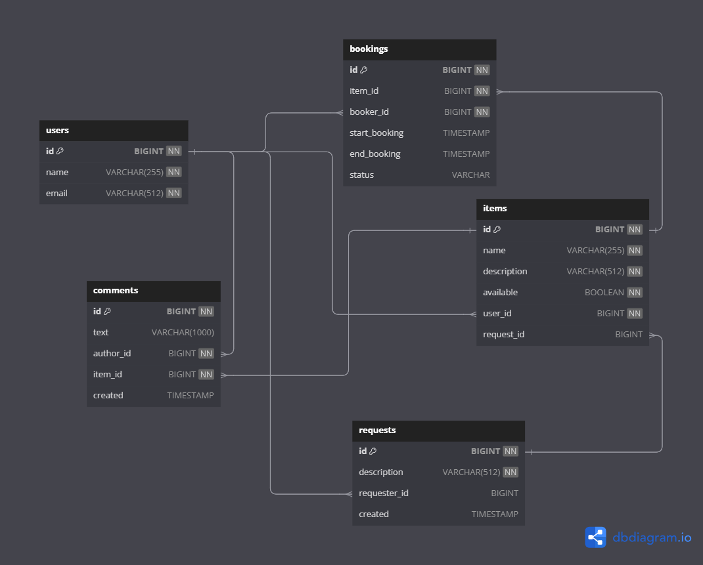

# Java-Shareit

## Бэкенд приложения для бронирования вещей
Приложение обеспечивает пользователям, во-первых, возможность рассказывать, какими вещами они готовы поделиться,
а во-вторых, находит нужную вещь и позволяет взять её в аренду на какое-то время.
Сервис не только позволяет бронировать вещь на определённые даты, но и закрывает к ней доступ на время бронирования от других желающих. На
случай, если нужной вещи в сервисе нет, у пользователей должна есть возможность оставлять запросы.
## ER-диаграмма приложения


## Реализованный функционал:
### Для работы с пользователями:
* Создание пользователя
* Получение пользователя по id
* Обновление пользователя
* Удаление пользователя
* Получение списка всех пользователей
### Для работы с предеметами:
* Создание предмета
* Обновление предмета
* Получение предмета по id
* Получение списка предметов выставленных для бронирования по id владельца вещей(без указания id получение списка всех вещей)
* Поиск вещей по названию/описанию
* Написание комментария к предмету после его бронирования
### Для работы с бронированием:
* Добавление запроса на бронирование
* Подтверждение или отклонение бронирования
* Получение данных о конкретном бронировании (включая его статус)
* Получение списка всех бронирований текущего пользователя
* Получение списка бронирований для всех вещей текущего пользователя
## Требования для запуска:
* JDK 11
* Git
* Maven
* Docker
## Запуск проекта:
* Скачивание проекта
```
git clone https://github.com/Dmitriy-Dyachihin/java-shareit.git
```
* Сборка проекта
```
cd java-share-it
mvn clean package
```
* Запуск проекта в Docker
```
docker-compose up
```
## Стек технологий:
* Java
* Rest API
* Docker
* Apache Maven
* PostgreSQL
* H2Database
* Hibernate
* Spring Boot
* Lombok
* Mapstruct
* JPA
* Mockito
* Postman
## Тестирование:
Postman-тесты для приложения [ссылка](https://github.com/Dmitriy-Dyachihin/java-shareit/tree/main/postman)